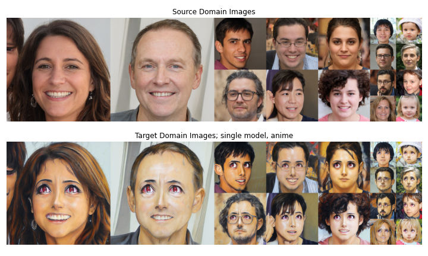
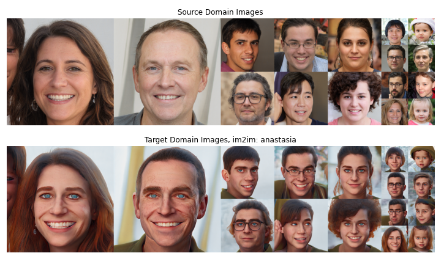
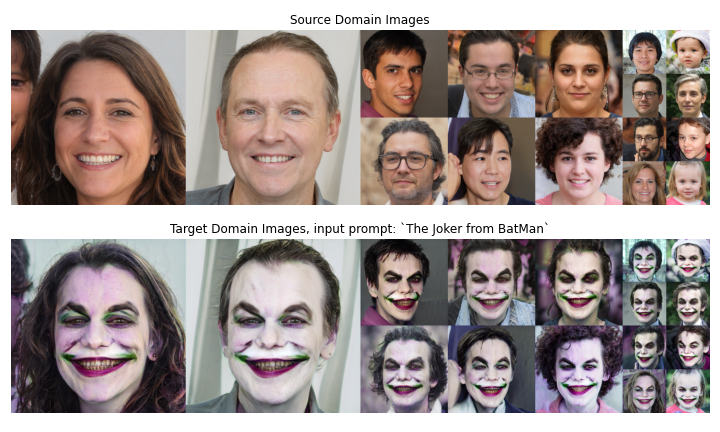
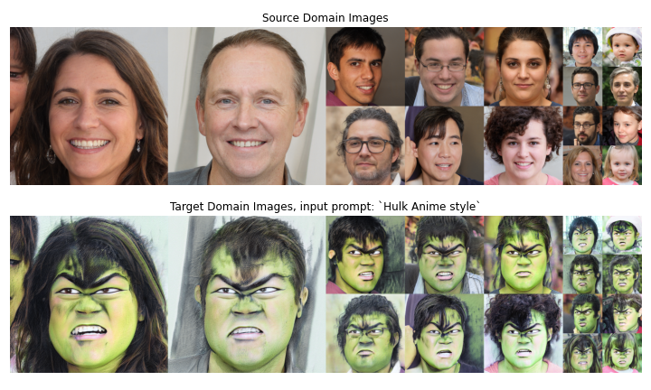

# HyperDomainNet: Universal Domain Adaptation for Generative Adversarial Networks (NeurIPS 2022)

Editing Playground: [](https://colab.research.google.com/drive/1QMylWjzPxvHtxm74U4lWRQXwquw5AaFL#scrollTo=si2tLKYLT-kV)

> **HyperDomainNet: Universal Domain Adaptation for Generative Adversarial Networks**<br>
> Aibek Alanov*, Vadim Titov*, Dmitry Vetrov <br>
> *Equal contribution <br>
> https://arxiv.org/abs/ <br>
>
>**Abstract:** Domain adaptation framework of GANs has achieved great progress in recent years as a main successful approach of training contemporary GANs in the case of very limited training data. In this work, we significantly improve this framework by proposing an extremely compact parameter space for fine-tuning the generator. We introduce a novel domain-modulation technique that allows to optimize only 6 thousand-dimensional vector instead of 30 million weights of StyleGAN2 to adapt to a target domain. We apply this parameterization to the state-of-art domain adaptation methods and show that it has almost the same expressiveness as the full parameter space. Additionally, we propose a new regularization loss that considerably enhances the diversity of the fine-tuned generator. Inspired by the reduction in the size of the optimizing parameter space we consider the problem of multi-domain adaptation of GANs, i.e. setting when the same model can adapt to several domains depending on the input query. We propose the HyperDomainNet that is a hypernetwork that predicts our parameterization given the target domain. We empirically confirm that it can successfully learn a number of domains at once and may even generalize to unseen domains.


## Table of Contents
  * [Description](#description)
  * [Updates](#updates)
  * [Getting Started](#getting-started)
    + [Notes](#notes)
    + [Dependencies](#dependencies)
  * [Training](#model-training)
  * [Inference](#pretrained-model-inference)
  * [Editing](#real-image-editing)
  * [Evaluation](#model-evaluation)
  * [Related Works](#related-works)
  * [Citation](#citation)
  
## Description
Official Implementation of HyperDomainNet, a method of domain adaptation technique utilizes both text-driven and one-shot setups.

Our method consist of several types of adaptation setups: 
- text-driven single domain adaptation
- image2image domain adaptation
- HyperDomainNet for any textual description
- HyperDomainNet for any given image (would be improved in future research).

There are three type of models: 
- Fine-tuned aligned child generator.
- Specific target domain modulation operator.
- Universal HyperDomainNet.

## Updates

**15/10/2022** Initial version

## Getting Started

For all the methods described in the paper, is it required to have:

- Anaconda
- PyTorch >=1.7.1
- Packages from requirements.txt

### Notes

Here, the code relies on the [Rosinality](https://github.com/rosinality/stylegan2-pytorch/) pytorch implementation of StyleGAN2.
Some parts of the StyleGAN implementation were modified, so that the whole implementation is native pytorch. 

In addition to the requirements mentioned before, a pretrained StyleGAN2 generator will attempt to be downloaded with script *download.py*.

### Dependencies

All base requirements could be installed via 

```shell script
conda install --yes -c pytorch pytorch=1.7.1 torchvision cudatoolkit=<CUDA_VERSION>
pip install -r requirements.txt
```

## Model training

Here, we provide the code for the training.

In general trainind could be launched by following command

```
python main.py exp.config={config_name}
```

### ***Config setup***

#### Exp:
  * `config_dir`: configs
  * `config`: config_name.yaml
  * `project`: `WandbProjectName`
  * `tags`:
    - tag1
    - tag2
  * `name`: `WandbRunName`
  * `seed`: 0
  * `root`: ./
  * `notes`: empty notes
  * `step_save`: 20 – *model dump frequency*
  * `trainer`: trainer_name
  
#### Training:
  * `iter_num`: 400 – *number of training iterations*
  * `batch_size`: 4
  * `device`: cuda:0
  * `generator`: stylegan2
  * `patch_key`: cin_mult
  * `phase`: mapping – **StyleGAN2 part which is fine-tuned, only used when `patch_key` = `original`**
  * `source_class`: Photo – *description of source domain*
  * `target_class`: 3D Render in the Style of Pixar – *description of target domain*
  * `auto_layer_k`: 16
  * `auto_layer_iters`: 0 – *number of iterations for adaptive corresponding stylegan2 layer freeze*
  * `auto_layer_batch`: 8
  * `mixing_noise`: 0.9

#### Optimization_setup:
  * `visual_encoders`: – *clip encoders that are used for clip based losses*
    - ViT-B/32
    - ViT-B/16
  * `loss_funcs`:
    - loss_name1
    - loss_name2
  * `loss_coefs`:
    - loss_coef1
    - loss_coef2
  * `g_reg_every`: 4 – *stylegan2 regularization coefficient (not recommended to change)* 
  * `optimizer`:
    * `weight_decay`: 0.0
    * `lr`: 0.01
    * `betas`:
      - 0.9
      - 0.999

#### Logging:
  * `log_every`: 10 – *loss logging step*
  * `log_images`: 20 – *images logging step*
  * `truncation`: 0.7 – *truncation during images logging*
  * `num_grid_outputs`: 1 – *number of logging grids*

#### Checkpointing:
  * `is_on`: false
  * `start_from`: false
  * `step_backup`: 100000

### Usage

When training ends model checkpoints could be found in `local_logged_exps/`. Each `ckpt_name.pt` could be inferenced using a helper classes `Inferencer` in `core/utils/example_utils`.

## Pretrained model Inference

Here, we provide the code for using pretrained checkpoints for inference.






### Setup

Pretrained models for various stylization are provided. 
Please refer to `download.py` and run it with flag `--load_type=checkpoints` inside root.

#### Additional notes

Downloaded checkpoints structure

```
    root/
        checkpoints/
            td_checkpoints/
                ...
            im2im_checkpoints/
                ...
            mapper_20_td.pt  
            mapper_large_resample_td.pt
            mapper_base_im2im.pt
```

Each model except `mapper_base_im2im.pt` could be inferenced with `Inferencer`, to infer `mapper_base_im2im.pt` `Im2ImInferencer`


### Usage

Given a pretrained checkpoint for certain target domain, one can edit a given image
This operation can be done through the `examples/inference_playground.ipynb` notebook

### Code details

Core functions are 
* mixing_noise (latent code generation)
* Inference (checkpoint processer)

## Real image editing

### Setup

Setup is same as in [Inference](#pretrained-model-inference) section

### Usage

Given a pretrained checkpoint for certain target domain, one can edit a given image
Playground for editing could be found in `examples/editing_playground.ipynb` notebook and in google-colab: [](https://colab.research.google.com/drive/1QMylWjzPxvHtxm74U4lWRQXwquw5AaFL#scrollTo=si2tLKYLT-kV)

## Model evaluation   

Here, we provide the code for evaluation based on clip metrics.  

### Setup

Before evaluation trained models needed to be got with one of two mentioned ways (`trained/pretrained`).

### Usage

Given a pretrained checkpoint for certain target domain, one can be evaluated through the `examples/evaluation.ipynb` notebook

## Related Works

Main idea is based on one-shot (text-drive, image2image) methods [StyleGAN-NADA](https://arxiv.org/abs/2108.00946) and [MindTheGap](https://arxiv.org/abs/2110.08398).

To edit real images, we inverted them to the StyleGAN's latent space using [ReStyle](https://github.com/yuval-alaluf/restyle-encoder).

## Citation

If you use this code for your research, please cite our paper:

```
@InProceedings{Alanov_2022_NeurIPS,
    author    = {Alanov, Aibek and Titov, Vadim and Vetrov, Dmitry},
    title     = {HyperDomainNet: Universal Domain Adaptation for Generative Adversarial Networks},
    month     = {October},
    year      = {2022},
}
```